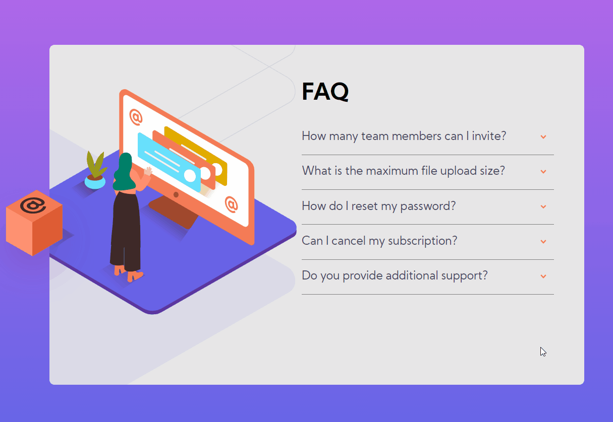

<h1 align="center">FAQ Accordion Card</h1>

    <a href="#objetivo">Objetivo</a> •
    <a href="#roadmap">Roadmap</a> • 
    <a href="#tecnologias">Tecnologias</a> • 
    <a href="#contribuicao">Contribuição</a> • 
    <a href="#licenc-a">Licença</a> • 
    <a href="#autor">Autor</a>

# 💻 Sobre o projeto

O FAQ é uma tela que lembra um cartão com uma lista de informações relevante para o usuário que deseja saber mais sobre o produto ou sistema.

<h3 align="center"> 
	🚧 🚀 Status de Andamento do Projeto: Card Finalizado.  🚧
</h3>

## Features

- [x] Criação de esqueleto HTML
- [x] Estilização de TAGs HTML 
- [x] Criação e renderização de elementos via JavaScript
- [x] Responsividade

## Está tela conta com:

- manipulação de imagens SVG utilizando background-image e TAG IMG para criação de uma só imagem linda!
- Linear Gradient para um toque de cores ainda mais atraente!
- Interação com o usuário que transforma os elementos em tela e mostra conteúdos!
- Media Query para lidar com responsividade em diversas telas!

 
    Os Design e Icones desta tela são disponibilizados pela plataforma 
    <a href="https://www.frontendmentor.io/solutions">Frontend Mentor</a>.
    A mesma propõe que desenvolvedores busquem projetar as telas solicitadas o mais próximo possível do design esperado. É um bom desafio!  

# 🛠 Tecnologias

As seguintes ferramentas foram usadas na construção do projeto:

- [HTML](https://developer.mozilla.org/pt-BR/docs/Web/HTML)
- [CSS3](https://developer.mozilla.org/pt-BR/docs/Web/CSS)
- [JavaScript](https://developer.mozilla.org/pt-BR/docs/Web/JavaScript)

# 🎨 Layout

## Mobile

 
    

## Desktop

 
    

## Apresentação

 
    

# Autor
Feito por Gabriel Brito ❤️👋🏽
 

