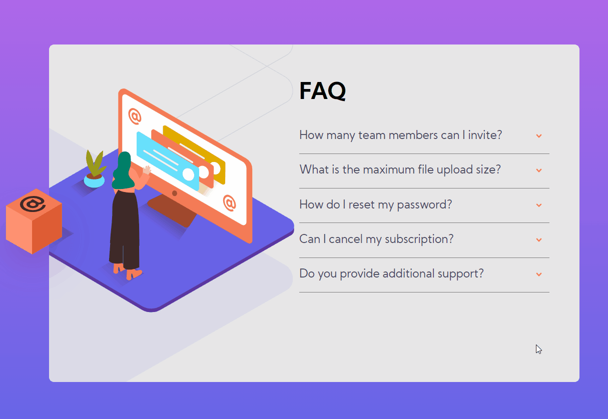

# FAQ Accordion Card

## Cartão explicativo super interessante!

 

### Está tela conta com:

 

- manipulação de imagens SVG utilizando background-image e TAG IMG para criação de uma só imagem linda!
- Linear Gradient para um toque de cores ainda mais atraente!
- Interação com o usuário que transforma os elementos em tela e mostra conteúdos!
- Media Query para lidar com responsividade em diversas telas!

 

## Tecnologias Envolvidas
- Html
- CSS3
- JavaScript

 

## Desktop
</img>

 

## Mobile
</img>

 

## Apresentação
</img>

